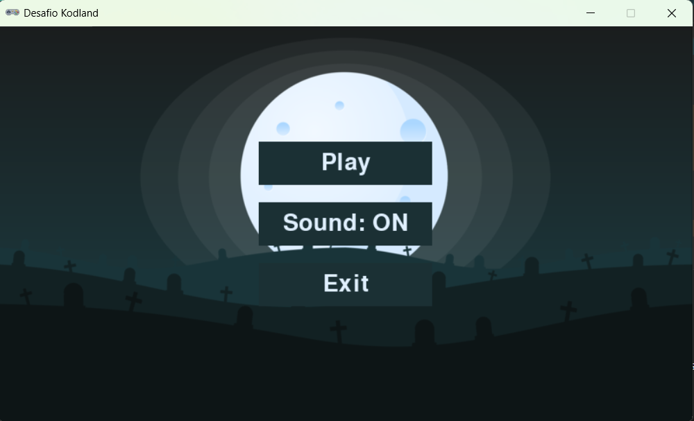

# Hunter Skull

## Hunter Skull é um game para DeskTop desenvolvido em Python. Sobreviva as caveiras do cemiterio da perigosa Cidade de Crystal City enquanto coleta as caveiras do tesouro. 

### Como iniciar o projeto

#### Clone o repositorio

``` bash
git clone https://github.com/brunovelosodossantos26/kodland
```

#### Instale a biblioteca Pygame Zero

``` bash
pip install pgzero
```

#### Inicie o projeto

``` bash
python myGame.py
```

## Telas do jogo

#### Menu inicial


#### Tela do jogo
